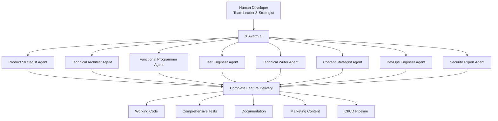

# XSwarm.ai - Transform Every Developer into an AI Team Leader

[](https://www.npmjs.com/package/xswarm)
[](https://opensource.org/licenses/MIT)
[](https://nodejs.org/)

🚀 **Website**: [xswarm.ai](https://xswarm.ai)
📦 **NPM Package**: [npmjs.com/package/xswarm](https://www.npmjs.com/package/xswarm)
🐙 **GitHub**: [github.com/chadananda/xswarm](https://github.com/chadananda/xswarm)

## The Story Behind XSwarm

I use Claude Code heavily in my daily development work. It's revolutionary. But I also run large human development teams, and here's what I've learned: the frustration with human teams is that you never have enough people. You're always resource-constrained, always making trade-offs between what needs to be done and who's available to do it.

The frustration with Claude Code, on the other hand, is different. It's incredibly capable but lacks the planning and orchestration that makes human teams effective. In a real development team, developers are just one part of the equation. To orchestrate developers effectively, you need Business Analysts to gather requirements, UX Designers to plan interfaces, DevOps Engineers to handle deployment, Project Managers to coordinate efforts, Testers to ensure quality, and Quality Assurance to maintain standards. These supporting roles are what allow developers to be truly effective.

Claude Code is amazing for coding tasks, but it's slow and single-task oriented. So I asked myself: **How do we create a real, scalable software development team with AI?**

The answer is XSwarm—a system that uses a mixture of specialized AI agents with Claude Code as part of a virtual team. It simulates the human development experience we know works: frontloading planning, then splitting development into highly parallel activities that can be executed extremely quickly with a high degree of quality and comprehensive testing.


## What XSwarm Really Is

XSwarm isn't just another AI coding assistant. It's a complete rethinking of how AI can work in software development. Instead of one AI doing everything sequentially, XSwarm orchestrates specialized agents that work in parallel—just like a real development team.

**The Sweet Spot:** Where LLMs, Git, GitHub, SQLite, Turso, MCP servers, TailwindCSS, ShadCN components, and CSS variables converge to create a complete development support ecosystem that works within any existing repository structure.

> ⚠️ **Current Status**: XSwarm.ai is in active development. The CLI placeholder and website are live. Full functionality coming Q2 2025.

## Quick Start

```bash
# Try it immediately with npx (no installation required)
npx xswarm

# Or install globally for repeated use
npm install -g xswarm
```

### Current Features

- ✅ Professional CLI with branded header
- ✅ Live website at [xswarm.ai](https://xswarm.ai)
- ✅ npm package namespace secured
- 🚧 Full AI agent coordination (coming Q2 2025)

## The Problem We're Solving

In traditional development, you face impossible choices:
- Need a new feature? Hire a developer (expensive, slow)
- Want better testing? Add a QA engineer (more overhead)
- Require documentation? Bring in a technical writer (another salary)

With AI tools like Claude Code, you get powerful assistance but:
- Single-threaded execution (one task at a time)
- No built-in planning or architecture phase
- Limited coordination between different aspects of development
- No parallel execution of independent tasks

XSwarm bridges this gap by providing the best of both worlds: AI's tireless execution with the proven patterns of human team organization.

## How It Works

Just like I manage my human teams, XSwarm follows a proven development workflow:

### 1. Planning Phase
Before any code is written, XSwarm's planning agents:
- Gather requirements through structured interviews
- Create technical specifications
- Design system architecture
- Identify potential challenges
- Plan testing strategies
- Estimate effort and complexity

### 2. Parallel Execution
Once planning is complete, XSwarm splits work into parallel streams:
- Multiple developer agents work on independent components
- Testing agents create comprehensive test suites
- Documentation agents write guides and API docs
- DevOps agents prepare deployment configurations
- All working simultaneously, not sequentially

### 3. Integration & Quality
As components complete:
- Review agents check code quality
- Integration testing ensures components work together
- Security agents audit for vulnerabilities
- Performance agents optimize bottlenecks

### 4. Delivery
The result is production-ready code with:
- Comprehensive test coverage
- Complete documentation
- Deployment configurations
- Performance optimizations
- Security best practices

## From Solo Developer to AI Team Leader

The shift is profound. Instead of writing every line of code yourself, you become a team leader who:

- **Sets Vision**: Define what needs to be built
- **Makes Decisions**: Choose between architectural options
- **Reviews Output**: Ensure quality meets standards
- **Guides Direction**: Adjust course based on results

Your AI team handles the implementation details while you focus on the big picture—exactly how the best human teams operate.



## Why This Matters

In my experience running both human teams and using AI tools, I've seen that neither approach alone is optimal. Human teams have the right structure but are expensive and slow. AI tools are fast but lack coordination.

XSwarm combines the best of both:
- **Human-like planning and coordination**
- **AI-powered execution speed**
- **Parallel processing for massive productivity**
- **Quality assurance built into every step**
- **Cost-effective and scalable**

## Real-World Impact

When fully implemented, XSwarm will enable:

- **10x faster development** through parallel execution
- **Higher quality** through comprehensive testing and review
- **Better documentation** created alongside code
- **Reduced context switching** for human developers
- **Scalable teams** without hiring overhead

## Technology Stack

XSwarm is built on proven technologies:

- **KaibanJS** for workflow orchestration
- **Claude Code SDK** with software development MCP servers
- **Git worktrees** for parallel development isolation
- **GitHub ecosystem** for project management
- **SQLite plus Turso** for local-first development
- **TailwindCSS and ShadCN** for component isolation
- **Automatic initialization** with project detection

## Development Philosophy

### Parallel-First Architecture
Unlike sequential AI coding, XSwarm identifies independent tasks and executes them simultaneously across multiple agents.

### Planning Before Coding
Every project starts with comprehensive planning—just like successful human teams do.

### Quality Through Specialization
Each agent specializes in one area, ensuring deep expertise rather than shallow generalization.

### Human Leadership
The developer remains in control, making strategic decisions while AI handles implementation.

## Getting Started

When you run XSwarm, you're not just launching a tool—you're assembling your team:

```bash
npx xswarm
```

The interactive CLI will:
1. Analyze your project context
2. Assemble appropriate AI agents
3. Conduct a planning interview
4. Begin orchestrated development

No commands to memorize. No complex configuration. Just describe what you want to build.

## Project Structure

```
xswarm/
├── cli/                    # CLI package (published to npm)
│   ├── src/               # CLI source code
│   ├── bin/               # Executable scripts
│   └── package.json       # CLI package configuration
├── website/               # Astro static website
│   ├── src/               # Website source
│   └── package.json       # Website dependencies
├── scripts/               # Development and deployment scripts
└── package.json          # Monorepo root configuration
```

## Contributing

We're building XSwarm in the open. Contributions are welcome!

### Development Setup

```bash
# Clone the repository
git clone https://github.com/chadananda/xswarm.git
cd xswarm

# Install dependencies
npm install

# Start development environment
npm run dev
```

### Contribution Guidelines

- Follow existing code patterns
- Add tests for new features
- Update documentation
- Submit PRs with clear descriptions

## Roadmap

### Phase 1: Foundation (Current) ✅
- [x] Secure npm namespace
- [x] Launch website
- [x] Create CLI placeholder
- [x] Setup infrastructure

### Phase 2: Core Implementation (Q1 2025)
- [ ] Agent base classes
- [ ] KaibanJS integration
- [ ] Git worktree management
- [ ] Basic task coordination

### Phase 3: Full Launch (Q2 2025)
- [ ] Complete expert agent library
- [ ] Interactive chat interface
- [ ] Project dashboard system
- [ ] Parallel execution engine

## The Vision

I believe the future of software development isn't about replacing developers—it's about amplifying them. Every developer should have access to the kind of team support that only large companies can afford today.

With XSwarm, a solo developer can work like they have a team of specialists. A small startup can compete with enterprise development teams. And large organizations can multiply their effectiveness without multiplying their headcount.

This is the future I'm building toward—where every developer is empowered to achieve their full potential.

## License

MIT License - see [LICENSE](LICENSE) file for details

## Contact

- 📧 Email: chadananda@gmail.com
- 🐛 Issues: [GitHub Issues](https://github.com/chadananda/xswarm/issues)
- 💬 Discussions: [GitHub Discussions](https://github.com/chadananda/xswarm/discussions)

---

**XSwarm.ai** - Transform Every Developer into an AI Team Leader