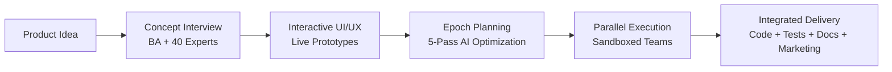

# XSwarm.ai - AI Development Epochs: Recursive Planning for Parallel Execution

[](https://www.npmjs.com/package/xswarm)
[](https://opensource.org/licenses/MIT)
[](https://nodejs.org/)

🚀 **Website**: [xswarm.ai](https://xswarm.ai)
📦 **NPM Package**: [npmjs.com/package/xswarm](https://www.npmjs.com/package/xswarm)
🐙 **GitHub**: [github.com/chadananda/xswarm](https://github.com/chadananda/xswarm)

## What Makes XSwarm Different

While others focus on better AI coding assistants, XSwarm revolutionizes the entire development process. We don't just use AI agents—we orchestrate complete development **epochs** with recursive planning specifically designed for AI characteristics.

**The Breakthrough**: AI teams don't have the same constraints as human teams. They can work in perfect parallel, they need atomic tasks, and they thrive with comprehensive planning. XSwarm is built from the ground up for these AI-specific characteristics.


> ⚠️ **Current Status**: XSwarm.ai is in active development. The CLI placeholder and website are live. Full functionality coming Q2 2025.

## The XSwarm Epoch System

### What's an Epoch?

An epoch is a complete development cycle that transforms ideas into production-ready features through AI-optimized planning and parallel execution. Unlike traditional sprints designed for human limitations, epochs are structured for AI capabilities.



### Phase 1: Concept Interview & Expert Consultation

The AI Business Analyst doesn't just gather requirements—it orchestrates consultations with 40+ specialized expert agents:

- **Product Experts**: Product Manager, Business Analyst, Growth Hacker
- **Design Experts**: UX Designer, UX Researcher, Motion Designer
- **Technical Experts**: Systems Architect, Security Engineer, ML Engineer
- **Quality Experts**: QA Engineer, Performance Tester, Security Auditor
- **Content Experts**: Technical Writer, Video Creator, Developer Advocate
- **Marketing Experts**: SEO Specialist, Social Media Manager, Content Strategist

Each expert provides domain-specific insights, ensuring nothing is missed before development begins.

### Phase 2: Interactive UI/UX Prototyping

Instead of static mockups, the UX Designer creates **working HTML prototypes**:

- 3 interactive variations for each design challenge
- Hosted on GitHub Pages for immediate stakeholder testing
- Real clicking, typing, and interaction—not PDFs
- Iteration based on actual usage, not imagination

### Phase 3: Multi-Pass AI-Optimized Planning

This is where XSwarm truly diverges from human-centric development:

#### Pass 1: Pure Function Extraction
- Identify ALL data transformations and calculations
- Build dependency graphs
- Create reusable function library (Sprint 0)
- Target: 60%+ function reuse across tasks

#### Pass 2: Sprint-Specific Functions
- Extract functions that depend on current state
- Plan shared utilities per sprint
- Create comprehensive registries

#### Pass 3: Task Decomposition
- Break features into atomic, single-outcome tasks
- Optimize for maximum parallelization
- Define clear interfaces between all tasks

#### Pass 4: Sprint Container Design
- Isolated environments with mock data
- Graduated complexity (simple → realistic)
- Complete test harnesses

#### Pass 5: Content Integration
- Map features to documentation needs
- Plan screenshot capture during testing
- Integrate marketing asset generation

### Phase 4: Parallel Sprint Execution

With planning complete, XSwarm unleashes parallel execution:

- **Sandboxed Task Teams**: Each task runs in an isolated container
- **No Coordination Overhead**: Complete isolation = no conflicts
- **Specialized Sub-Agents**: Implementation, Testing, Review, Documentation
- **Automatic Integration**: Orchestrator handles all merging

### Phase 5: Integrated Delivery

Every sprint delivers:
- **Production Code**: Tested and reviewed
- **Comprehensive Tests**: Unit, integration, and E2E
- **Documentation**: Generated from actual implementation
- **Marketing Assets**: Screenshots, videos, blog posts
- **Deployment Config**: Ready for production

## Why This Changes Everything

### Traditional AI Development Problems

1. **Sequential Execution**: AI writes code → Human tests → AI writes docs → Repeat
2. **Context Loss**: Every session starts fresh, recreating the same utilities
3. **No Real Planning**: Prompt engineering isn't architecture
4. **Integration Nightmares**: "It worked in isolation"
5. **Token Waste**: 90% spent on context and regeneration

### The XSwarm Solution

1. **Parallel Execution**: Multiple isolated teams working simultaneously
2. **Function Registries**: Reuse instead of regenerate
3. **Comprehensive Planning**: 5-pass optimization before any code
4. **Sandboxed Testing**: Integration happens in containers first
5. **Token Efficiency**: 10x reduction through reuse and isolation

## Quick Start

```bash
# Try it immediately with npx (no installation required)
npx xswarm

# Or install globally for repeated use
npm install -g xswarm
```

## Real Impact Metrics

When fully implemented, XSwarm enables:

- **10x Faster Development**: True parallel execution
- **60%+ Code Reuse**: Function registries prevent duplication
- **90% Token Reduction**: Efficient context and reuse
- **Zero Integration Surprises**: Sandboxed testing catches everything
- **Complete Deliverables**: Code + Tests + Docs + Marketing

## The Technology Stack

- **Epoch Orchestration**: Custom planning engine for AI teams
- **Sandboxed Execution**: Podman containers with complete isolation
- **Interactive Prototypes**: TailwindCSS + ShadCN + AlpineJS
- **Function Registries**: Searchable, reusable component libraries
- **Parallel Coordination**: Kaiban dashboards for real-time visibility
- **Content Pipeline**: Automated asset generation during development

## From Solo Developer to Epoch Commander

Instead of crafting prompts for a single AI, you command entire development epochs:

1. **Define Vision**: What needs to be built
2. **Review Plans**: Approve epoch strategy
3. **Monitor Execution**: Watch parallel progress
4. **Validate Delivery**: Ensure quality standards

Your role evolves from coder to commander, from implementer to strategist.

## Development Philosophy

### AI-First, Not Human-Adapted
Every aspect of XSwarm is designed for AI characteristics:
- Parallel execution without ego conflicts
- Atomic tasks with clear success criteria
- Comprehensive mocking for deterministic results
- Function reuse as a core principle

### Planning Prevents Problems
Multi-pass planning isn't bureaucracy—it's optimization:
- Pure functions first = maximum reuse
- Clear interfaces = parallel execution
- Sandboxed testing = safe integration
- Content planning = launch-ready features

### Specialization Over Generalization
40+ expert agents because expertise matters:
- Security experts find vulnerabilities
- Performance experts prevent bottlenecks
- Marketing experts create authentic content
- Each agent masters their domain

## Roadmap

### Phase 1: Foundation ✅
- [x] Secure npm namespace
- [x] Launch website
- [x] Create CLI placeholder
- [x] Define epoch methodology

### Phase 2: Core Systems (Q1 2025)
- [ ] Epoch planning engine
- [ ] Sandboxed execution environment
- [ ] Function registry system
- [ ] Interactive prototype generator

### Phase 3: Full Launch (Q2 2025)
- [ ] 40+ expert agent library
- [ ] Parallel execution orchestrator
- [ ] Kaiban dashboard integration
- [ ] Complete content pipeline

## Contributing

We're building XSwarm in the open. Join us in revolutionizing AI development!

```bash
# Clone the repository
git clone https://github.com/chadananda/xswarm.git
cd xswarm

# Install dependencies
npm install

# Start development environment
npm run dev
```

## The Vision

The future of software development isn't better AI assistants—it's AI development teams that understand how to work together. XSwarm makes every developer a commander of specialized AI agents, orchestrating complete development epochs that deliver production-ready features with unprecedented speed and quality.

This isn't incremental improvement. This is a fundamental reimagining of how software gets built.

## License

MIT License - see [LICENSE](LICENSE) file for details

## Contact

- 📧 Email: chadananda@gmail.com
- 🐛 Issues: [GitHub Issues](https://github.com/chadananda/xswarm/issues)
- 💬 Discussions: [GitHub Discussions](https://github.com/chadananda/xswarm/discussions)

---

**XSwarm.ai** - Command AI Epochs. Ship Complete Features.