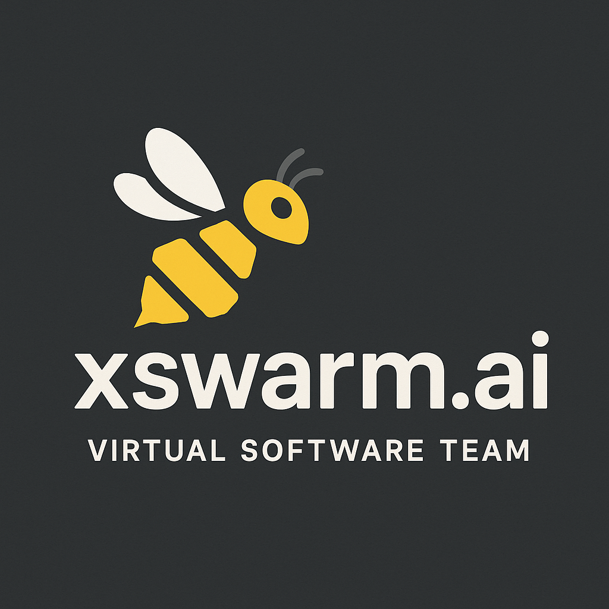
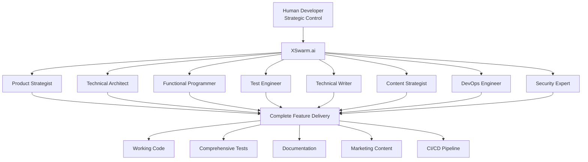
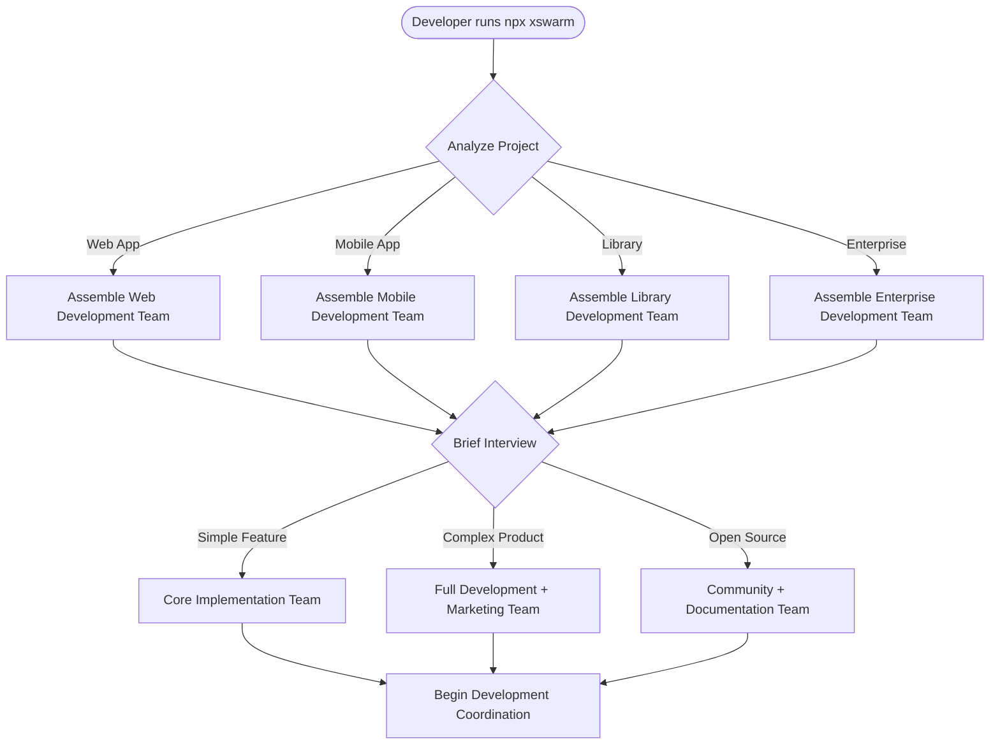
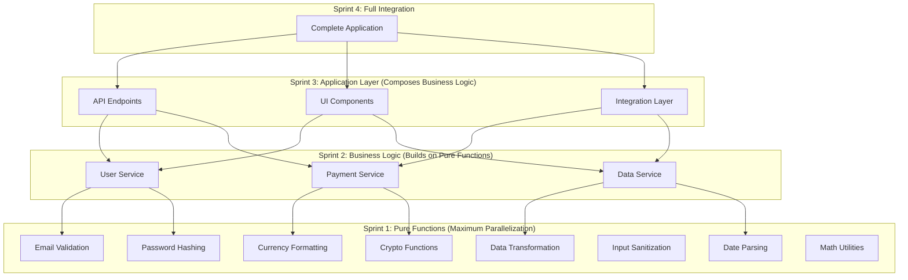
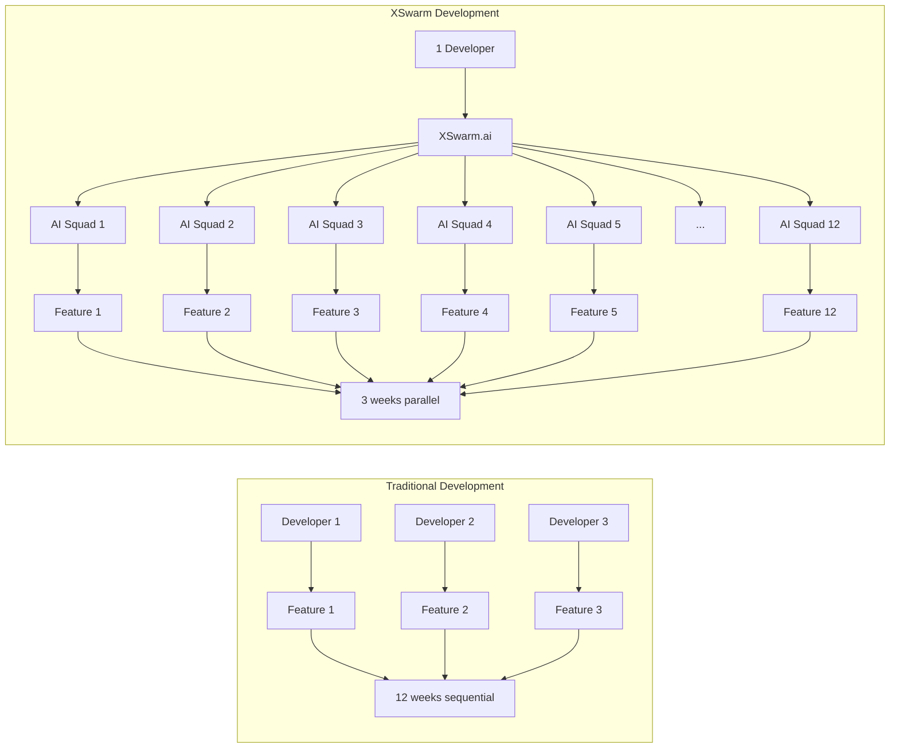
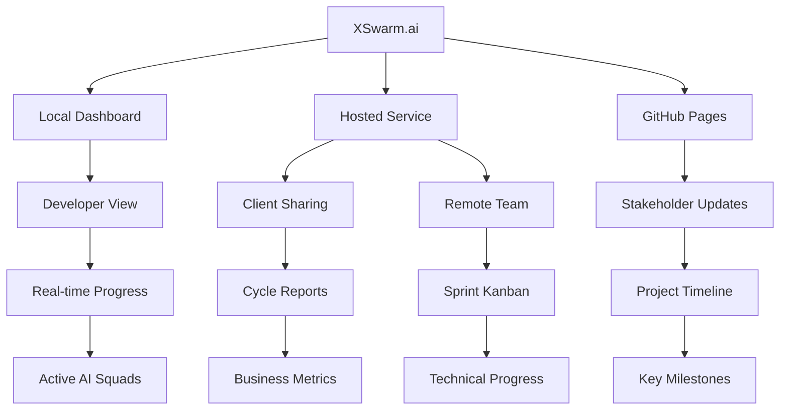

# XSwarm.ai - Transform yourself into a Team of One

[](https://www.npmjs.com/package/xswarm)
[](https://opensource.org/licenses/MIT)
[](https://nodejs.org/)

🚀 **Website**: [xswarm.ai](https://xswarm.ai)
📦 **NPM Package**: [npmjs.com/package/xswarm](https://www.npmjs.com/package/xswarm)
🐙 **GitHub**: [github.com/xswarm/xswarm](https://github.com/xswarm/xswarm)

## Core Vision: AI Support Teams for Developers
XSwarm is not a generic agent orchestration system. It's a highly specialized implementation that provides each developer with a complete AI support team, transforming individual productivity by leveraging the natural coordination capabilities of Git and GitHub.



**The Sweet Spot:** Where LLMs, Git, GitHub, SQLite, Turso, MCP servers, TailwindCSS, ShadCN components, and CSS variables converge to create a complete development support ecosystem that works within any existing repository structure, from small feature enhancements to full application development.

> ⚠️ **Current Status**: XSwarm.ai is in active development. The CLI placeholder and website are live. Full functionality coming Q2 2025.

## Quick Start

### Installation

```bash
# Try it immediately with npx (no installation required)
npx xswarm

# Or install globally for repeated use
npm install -g xswarm
```

### Current Features

- ✅ Professional CLI with branded header
- ✅ Live website at [xswarm.ai](https://xswarm.ai)
- ✅ npm package namespace secured
- 🚧 Full AI agent coordination (coming Q2 2025)

### Utility-First Approach
XSwarm operates seamlessly within existing repositories. Simply navigate to any project directory and run the tool - it initializes itself after conducting a brief project interview. No manual setup, folder creation, or workflow changes required.

**Repository Agnostic:**
- Works with existing monorepos, multi-repos, or single-purpose repositories
- Integrates with current project structures without reorganization
- Respects existing documentation, testing, and deployment workflows
- Adds capabilities rather than replacing existing systems

**Flexible Integration:**
While monorepo structures can enhance XSwarm's capabilities by keeping everything together, the system is designed to be valuable in any repository configuration. The automatic initialization approach ensures broad compatibility and low barrier to adoption.

### Pre-Built Expert Agent Library
Unlike generic frameworks such as CrewAI or AutoGen, XSwarm ships with production-ready, specialized agent classes for software development workflows. These agents are built using JavaScript inheritance patterns, allowing users to easily extend and customize them while benefiting from continuous improvements to the base classes through code updates.

**Curated Expert Specializations:**

**Strategic Planning Experts:**
- Product strategists for market analysis, user research, and competitive positioning
- Business analysts for requirements gathering, stakeholder management, and success metrics
- Project coordinators for timeline planning, resource allocation, and risk assessment

**Technical Implementation Experts:**
- Technical architects for system design and technology selection
- Functional programmers for pure function extraction and elegant code patterns
- Full-stack developers for feature implementation, API development, and UI creation
- Security engineers for OWASP compliance and vulnerability assessment
- Performance engineers for benchmarking and scalability analysis

**Quality Assurance Experts:**
- Test engineers for comprehensive coverage including property-based testing
- QA specialists for end-to-end validation and user experience testing
- Security auditors for penetration testing and compliance validation

**Documentation and Content Experts:**
- Technical writers for API documentation and architectural decisions
- User experience writers for guides, tutorials, and onboarding flows
- Content strategists for blog posts, tutorials, and thought leadership

**User Experience and Design Experts:**
- UX research specialists for user journey analysis and usability testing
- Interactive mockup creators for rapid prototyping with Alpine.js and Tailwind CSS during design discussions
- Design system architects for consistent visual language and component libraries
- Accessibility specialists for WCAG compliance and inclusive design
- Visual design experts for branding, typography, and aesthetic refinement

**Operations and Marketing Experts:**
- DevOps engineers for CI/CD pipelines, deployment automation, and monitoring
- Marketing specialists for content creation, social media, and campaign development
- Video producers for demo creation, tutorial videos, and presentation materials

### Curated for the Development Sweet Spot
**Target Use Cases:**
- Small feature additions to existing websites/applications
- Full greenfield application development
- Legacy system modernization and enhancement
- Technical debt reduction projects
- Documentation and marketing material creation

**Not Targeting:**
- Generic business process automation
- Non-software development workflows
- Enterprise-scale system integration
- Complex multi-system orchestration

### Technology Stack Optimization
XSwarm is purpose-built around a specific, proven technology stack that creates natural synergies and works within any existing repository structure.

**Core Technologies:**
- **KaibanJS** for development workflow orchestration
- **Claude Code SDK** with software development MCP servers
- **Git worktrees** for maximum parallelization with isolation
- **GitHub ecosystem** for issues, actions, discussions, and pages
- **SQLite plus Turso** for local-first development with cloud sync
- **TailwindCSS and ShadCN** for component isolation and design system consistency
- **CSS variables and modern styling** for theme management and responsive design
- **Automatic initialization** with project context detection and folder creation
- **VS Code integrated CLI** working where developers already are

**Component Isolation Benefits:**
TailwindCSS utility classes and ShadCN component patterns enable AI agents to create truly isolated, reusable components. CSS variables provide theme consistency while allowing easy customization. This technology combination ensures that AI-generated UI components integrate seamlessly with existing design systems while maintaining independence for testing and iteration.

**Repository Flexibility:**
XSwarm adapts to existing repository structures rather than imposing requirements. Whether working in a monorepo, multi-repo setup, or single-purpose repository, the automatic initialization approach ensures compatibility and ease of adoption.

### Developer Productivity Amplification

XSwarm provides each developer with a complete AI support team that leverages Git and GitHub's coordination capabilities to dramatically boost productivity. Whether working on a small feature enhancement or a full application, developers gain access to specialized expertise that was previously only available to large teams.

**The "Team of One" Philosophy:**
Every developer gets their own virtual team of specialists - architects, testers, technical writers, content creators, and DevOps engineers - all coordinated through familiar Git workflows and GitHub project management tools.



**Productivity Multiplication:**
- **Individual Focus:** Developer maintains strategic control and creative direction
- **Expert Support:** AI specialists handle implementation details, testing, documentation, and content creation
- **Parallel Execution:** Git worktrees enable simultaneous work on dozens of tasks
- **GitHub Coordination:** Issues, discussions, and actions provide project management without external tools
- **Adaptive Deliverables:** Each project gets appropriate output based on its needs and context

### Chat-First Interface
XSwarm launches into an interactive chat session within the terminal, similar to Claude Code's interface. Simply change directory to your project and run `npx xswarm` - the tool automatically detects project context and conducts a brief initialization interview before beginning development coordination.

**Seamless Startup Experience:**
Running XSwarm in any project directory opens a sophisticated input interface that analyzes the existing codebase, asks targeted questions about project goals, and assembles the appropriate AI expert team dynamically. No manual configuration required.



**Example Interaction:**
Developer navigates to their project folder and runs the tool. XSwarm detects it's a web application, analyzes the current state, and asks about development goals. When the developer describes wanting to add expense tracking features, XSwarm's expert team immediately begins competitive analysis and feature planning based on the existing project context.

## Project Integration Philosophy

### Minimal Disruption Approach
XSwarm maintains strict boundaries with existing project structures. All XSwarm-generated content lives within a dedicated folder, ensuring that existing codebases, documentation systems, and project organization remain untouched.

### Automatic Project Detection and Setup
XSwarm intelligently analyzes the current directory to understand project context, technology stack, and existing structure before conducting its initialization interview.

**Smart Context Detection:**
- Analyzes existing files to understand project type and technology stack
- Detects current development patterns and coding standards
- Identifies existing documentation and project management approaches
- Assesses team size and collaboration patterns from Git history

### Adaptive Feature Selection
Based on project analysis and initialization interview responses, XSwarm determines which capabilities are relevant for the specific project:

**Project Types and Features:**
- **Small Feature Enhancement:** Code implementation, testing, basic technical documentation
- **Open Source Library:** Comprehensive documentation, API guides, community content, tutorials
- **Commercial Product:** Full marketing suite including blog posts, social media assets, case studies
- **Enterprise Application:** Security audits, compliance documentation, technical architecture docs
- **Personal Project:** Streamlined approach focusing on core functionality and basic documentation

### Project Initialization Interview Process
XSwarm asks targeted questions to understand project context and stakeholder needs:

**Project Context Discovery:**
- What type of project is this? (library, application, enhancement, etc.)
- Who are the intended users or audience?
- What documentation already exists and should be preserved?
- Are there marketing or content creation needs?
- What testing and quality standards are required?
- Are there compliance or security requirements?

**Content Strategy Selection:**
Based on responses, XSwarm enables only relevant expert agents and content creation capabilities. A simple bug fix project won't get marketing content generation, while a new SaaS product will get the full content strategy treatment.

### Flexible Project Structure
The XSwarm folder adapts to project needs, containing only relevant directories:

**Minimal Configuration (Simple Projects):**
- Project configuration and planning documents
- Task coordination and progress tracking
- Basic technical documentation as needed

**Full Configuration (Complex Projects):**
- Comprehensive planning and architecture documentation
- Marketing content creation and asset management
- User guides, tutorials, and educational materials
- Performance benchmarks and security audit reports
- Integration testing and deployment automation

### Existing Project Respect
XSwarm integrates with rather than replaces existing project management, documentation, and content systems. It works alongside current workflows, enhancing rather than disrupting established practices.

## Expert Agent Architecture

### Production-Ready Agent Library

XSwarm provides production-ready expert agents built with JavaScript class inheritance patterns. This approach allows users to extend and customize agents while automatically receiving improvements through base class updates.

**Base Class Foundation:**
Each expert agent inherits from foundational classes that encode months of real-world optimization and battle-tested development practices. Users can extend these classes to add company-specific requirements, industry compliance needs, or custom workflows while preserving the core expertise.

**Continuous Improvement:**
When XSwarm releases updates to base agent classes, users automatically inherit improvements to methodology, quality standards, and best practices. This creates a continuously evolving expert team that gets smarter over time.

**Immediate Professional Value:**
Unlike generic agent frameworks that require extensive prompt engineering and workflow design, XSwarm agents work professionally out of the box. Install XSwarm, run it in any project folder, and immediately access expert-level capabilities across all development disciplines.

### Modular Architecture with Flexible API Management

**Pluggable Components Design:**
XSwarm follows a modular architecture where components can be enabled or disabled based on project needs and developer preferences. The core functionality works entirely through GitHub-based workflows, with optional enhanced interfaces available as separate packages.

**API Key Management Strategy:**
- **Global Keys:** Stored securely for developer convenience and rapid setup
- **Project-Specific Keys:** Override global settings for client cost tracking or corporate key management
- **Multi-Provider Support:** Developers can plug in their preferred LLM providers and keys
- **Secure Storage:** Keys encrypted locally with project-specific access controls

**Optional Interactive UX Environment:**
The localhost browser-based UX review system deploys as a standalone Svelte application distributed through npm. Features include multiple UI proposals in tabbed interface with Alpine.js and Tailwind CSS, integrated chat with element selection and responsive testing tools, real-time AI iteration based on feedback, automatic synchronization with GitHub discussions for remote collaboration, and voice interface capabilities for hands-free interaction.

**Fallback to GitHub Discussions:**
Projects can operate entirely through GitHub discussions if developers prefer simpler workflows or don't need enhanced UX review capabilities. The core value proposition remains intact regardless of interface choice.

### Comprehensive Requirements Gathering Process

**Structured Interview Framework:**
AI development requires exceptional clarity to avoid ambiguity and conflicts during execution. XSwarm implements a multi-stage interview process that progressively refines project understanding.

**Discovery Phases:**
- **Project Context Assessment:** Understanding existing codebase, stakeholder structure, and constraints
- **Technical Requirements Analysis:** Performance, security, scalability, and integration needs
- **User Experience Exploration:** Target audiences, user journeys, and interface expectations
- **Content and Marketing Needs:** Documentation requirements, marketing goals, and brand guidelines
- **Quality and Compliance Standards:** Testing coverage, security audits, and regulatory requirements

**Iterative Refinement:**
The interview process includes validation loops where AI agents present their understanding back to stakeholders for confirmation and correction, ensuring alignment before development begins.

**Decision Documentation:**
All requirements gathering conversations and decisions are captured in structured formats that inform the multi-pass planning process and provide context for future development decisions.

## Worktree-Centric Development Model

**Adaptive Integration Strategy:**
XSwarm supports multiple integration approaches based on project context and developer permissions, including direct integration for owned projects, pull request workflows for collaborative environments, and feature branch coordination for enterprise workflows.

**Isolated Task Development:**
Each task receives its own isolated worktree where AI expert squads perform complete development cycles including implementation, testing, documentation, and content creation. This ensures quality through comprehensive process execution rather than post-implementation review.

**Massive Parallel Development:**
A single human developer coordinates numerous AI agent squads working simultaneously on micro-tasks. Each task gets its own dedicated expert squad and isolated worktree for maximum parallelization, with integration methods determined by project permissions and workflow requirements.

**Pure Function First Strategy:**
XSwarm always extracts and implements pure functions in the initial sprint to create a highly-parallelizable, thoroughly-tested foundation. This strategy minimizes complex functionality in later sprints while maximizing reliable building blocks available for feature composition.



## Development Coordination and Progress Tracking

**Development Terminology:**
- **Cycle:** Complete planning → implementation → integration round delivering specific functionality
- **Sprint:** Set of parallelizable tasks that execute simultaneously within a cycle
- **Task:** Individual work item executed by an AI expert squad in a dedicated worktree
- **Squad:** Specialized AI agents assigned to complete a specific task

```mermaid
gantt
    title XSwarm Development Cycle
    dateFormat X
    axisFormat %s

    section Sprint 1: Pure Functions
    Email Validation     :done, task1, 0, 2
    Password Hashing     :done, task2, 0, 2
    Data Transformation  :done, task3, 0, 2
    Token Generation     :done, task4, 0, 2

    section Sprint 2: Business Logic
    Auth Service         :active, task5, 2, 6
    User Repository      :active, task6, 2, 6
    Session Manager      :active, task7, 2, 6

    section Sprint 3: API & UI
    Auth Endpoints       :task8, 6, 9
    Login Components     :task9, 6, 9
    User Dashboard       :task10, 6, 9

    section Sprint 4: Integration
    E2E Testing          :task11, 9, 11
    Performance Opt      :task12, 9, 11
    Security Audit       :task13, 9, 11
```



**Dual Progress Visualization:**
XSwarm provides both local CLI monitoring and hosted dashboard viewing with a TOP-like real-time display showing active AI squads, progress bars, resource usage, and completion estimates within the terminal, alongside sprint-focused project visualization with shareable URLs for stakeholder viewing and remote team coordination.

**Real-Time Development Monitoring:**
The CLI interface provides immediate feedback for developers actively coordinating work, while the hosted dashboard offers sprint-by-sprint project views for planning sessions, stakeholder updates, and distributed team collaboration.

**Unlimited Parallel Execution:**
Unlike traditional sprints constrained by human team size, XSwarm sprints are limited only by dependency relationships. Sprint planning optimizes for maximum parallelization - if dozens of tasks can execute simultaneously because they share no dependencies, then dozens of AI squads work in parallel during that sprint.



**Human Orchestration with Flexible Integration:**
The human developer coordinates massive parallel development while working within existing project constraints and permission structures. During initialization, XSwarm determines the appropriate integration approach whether direct integration, pull request workflows, or feature branch coordination.

## Project Dashboard System

### Cycle Management and Review
The dashboard provides comprehensive cycle tracking with detailed summaries of each development round. Each cycle entry includes objectives achieved, features delivered, technical decisions made, and lessons learned for future cycles.

### Dashboard Deployment Options
**Local Dashboard:** Integrated into the development environment for immediate access and private project coordination.

**Hosted Service:** Optional cloud hosting for project dashboards enabling client sharing and remote team collaboration. This service operates on a freemium model with basic project sharing free and advanced features available at low cost.

**GitHub Pages Integration:** Alternative hosting through GitHub Pages using modern web technologies for projects preferring to keep everything within their existing GitHub ecosystem.



### Stakeholder Communication
Dashboards serve as the primary interface for communicating project progress to clients, stakeholders, and distributed team members. Each cycle summary provides business-focused progress reports alongside technical implementation details.

### Sprint Visualization
The Kanban interface focuses on current sprint progress while maintaining historical context. Stakeholders can review past cycles, understand current sprint progress, and see projected completion timelines without getting overwhelmed by task-level details.

## Project Structure

```
xswarm/
├── cli/                    # CLI package (published to npm)
│   ├── src/               # CLI source code
│   │   ├── index.js       # Main entry point
│   │   ├── header.js      # Branded terminal header
│   │   └── placeholder.js # Coming soon message
│   ├── bin/               # Executable scripts
│   └── package.json       # CLI package configuration
├── website/               # Astro static website
│   ├── src/               # Website source
│   │   ├── pages/         # Static pages
│   │   ├── layouts/       # Page layouts
│   │   └── components/    # Reusable components
│   └── package.json       # Website dependencies
├── scripts/               # Development and deployment scripts
│   ├── dev.js            # Concurrent development
│   ├── build.js          # Build both packages
│   ├── deploy-cli.js     # Publish CLI to npm
│   └── update-site.js    # Deploy website
└── package.json          # Monorepo root configuration
```

## Development

### Prerequisites

- Node.js >= 18.0.0
- npm >= 8.0.0
- Git

### Local Development Setup

```bash
# Clone the repository
git clone https://github.com/xswarm/xswarm.git
cd xswarm

# Install dependencies
npm install

# Start development environment (CLI + Website)
npm run dev
```

### Available Scripts

| Command | Description |
|---------|-------------|
| `npm run dev` | Start concurrent development (CLI + Website) |
| `npm run build` | Build both CLI and website |
| `npm run build:cli` | Build CLI package only |
| `npm run build:website` | Build website only |
| `npm run test` | Run tests across all workspaces |
| `npm run lint` | Lint all JavaScript and Astro files |
| `npm run format` | Format code with Prettier |
| `npm run deploy:cli` | Publish CLI to npm (requires NPM_TOKEN) |
| `npm run update:site` | Deploy website to GitHub Pages |

## Contributing

We welcome contributions! Please follow these guidelines:

### Code Style

- No blank lines in code - use comments to separate sections
- Single-line if statements when possible
- Functional/compact style with chaining
- All functions exported inline: `export const functionName = () => {}`
- JSDoc headers for all functions

### Development Workflow

1. Fork the repository
2. Create a feature branch (`git checkout -b feature/amazing-feature`)
3. Make your changes following our code style
4. Run tests and linting (`npm test && npm run lint`)
5. Commit with conventional commits (`feat:`, `fix:`, `docs:`, etc.)
6. Push to your fork and open a Pull Request

### Commit Message Format

```
feat: add new agent coordination system

- Implemented parallel task execution
- Added test coverage for new features
- Updated documentation
```

## Deployment

### CLI Publishing (Manual)

```bash
# Ensure you have NPM_TOKEN configured
export NPM_TOKEN=your-npm-token

# Publish to npm
npm run deploy:cli
```

### Website Deployment

```bash
# Build and deploy to GitHub Pages
npm run update:site
```

## Roadmap

### Phase 1: Foundation (Current) ✅
- [x] Secure npm namespace
- [x] Launch website at xswarm.ai
- [x] Create CLI placeholder
- [x] Setup monorepo structure

### Phase 2: Core Implementation (Q1 2025)
- [ ] Agent base classes
- [ ] KaibanJS integration
- [ ] Git worktree management
- [ ] Basic task coordination

### Phase 3: Full Launch (Q2 2025)
- [ ] Complete expert agent library
- [ ] Interactive chat interface
- [ ] Project dashboard system
- [ ] Marketing content generation

## Technology Stack

- **CLI**: Node.js 18+, ESM modules
- **Website**: Astro, TailwindCSS
- **Deployment**: GitHub Pages, npm registry
- **Development**: npm workspaces, concurrent execution
- **Future**: KaibanJS, Claude Code SDK, Git worktrees

## License

MIT License - see [LICENSE](LICENSE) file for details

## Documentation

- 📚 [Development Guide](docs/DEVELOPMENT.md) - Complete development workflow
- 🚀 [Deployment Guide](docs/DEPLOYMENT.md) - CLI and website deployment
- 🔐 [GitHub Secrets Setup](docs/GITHUB_SECRETS.md) - Configure automated deployments
- 🧪 [Testing Guide](docs/TESTING.md) - Test coverage and running tests
- 🤖 [Claude Instructions](CLAUDE.md) - AI development guidelines

## Support

- 📧 Email: chadananda@gmail.com
- 🐛 Issues: [GitHub Issues](https://github.com/xswarm/xswarm/issues)
- 💬 Discussions: [GitHub Discussions](https://github.com/xswarm/xswarm/discussions)

---

**XSwarm.ai** - Empowering solo developers with AI-powered development teams
