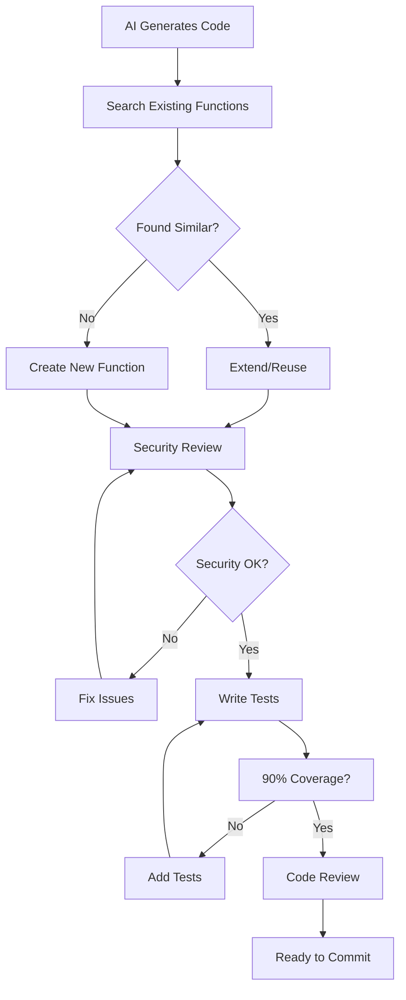

# AI Development Best Practices

## Overview

This document outlines common problematic behaviors exhibited by AI coding assistants and establishes procedures to prevent technical debt accumulation. These patterns have been observed across multiple AI systems (Claude, GPT-4, Copilot, etc.).

## Common AI Anti-Patterns

### 1. Over-Engineering Simple Solutions

**What AI Does:**
- Creates complex architectures for simple problems
- Adds unnecessary abstraction layers
- Implements features that weren't requested
- Uses advanced patterns where basic ones suffice

**Example:**
```javascript
// Task: "Add a function to validate email"
// AI creates:
class EmailValidatorFactory {
  static createValidator(type = 'RFC5322') {
    return new EmailValidator(type);
  }
}
class EmailValidator extends AbstractValidator {
  // 200 lines of code...
}

// Should be:
const isValidEmail = (email) => /^[^\s@]+@[^\s@]+\.[^\s@]+$/.test(email);
```

**Prevention:**
- Always request "minimal implementation"
- Specify "no extra features"
- Ask for "simplest solution that works"

### 2. Reinventing Existing Code

**What AI Does:**
- Recreates utility functions that already exist
- Builds new components instead of using existing ones
- Ignores established patterns in the codebase
- Creates duplicate implementations

**Example:**
```javascript
// AI creates formatDate() when dateUtils.js already has one
// AI builds new Modal component when Modal.astro exists
// AI writes custom fetch wrapper when api.js has one
```

**Prevention:**
- Always say "check for existing implementations first"
- Require AI to search before creating
- Use prompts like "use existing utilities where possible"

### 3. File Organization Chaos

**What AI Does:**
- Mixes temporary scripts with core code
- Creates files in wrong directories
- Doesn't follow project structure
- Leaves test/demo files in production paths

**Example:**
```
/src/
  components/
    Card.astro
    test-card.js      ❌ Test file in components
    demo.html         ❌ Demo in components
  generate-images.js  ❌ Script in src
```

**Prevention:**
- Explicitly specify file locations
- Define clear project structure rules
- Say "put temporary scripts in /scripts folder"
- Add "delete after use" for one-time scripts

### 4. Scope Creep

**What AI Does:**
- Modifies unrelated code while fixing issues
- "Improves" code that wasn't broken
- Refactors beyond the requested scope
- Adds "helpful" features not asked for

**Example:**
```javascript
// Task: "Fix the email validation"
// AI also:
// - Refactors the entire form component
// - Updates the CSS framework
// - Adds password strength meter
// - Rewrites the API calls
```

**Prevention:**
- Use "ONLY fix [specific thing]"
- Say "do not modify any other code"
- Specify "keep changes minimal"
- List files that can be modified

### 5. Context Loss Between Sessions

**What AI Does:**
- Forgets previous decisions
- Recreates already-solved problems
- Changes established patterns
- Reverts intentional design choices

**Prevention:**
- Document decisions in code comments
- Create CLAUDE.md for AI instructions
- Use consistent file naming
- Add "continuation" comments in code

### 6. Import/Dependency Chaos

**What AI Does:**
- Adds unnecessary dependencies
- Imports libraries already available
- Uses different import styles
- Creates circular dependencies
- **Installs outdated versions by default**

**Example:**
```javascript
// AI adds:
import _ from 'lodash';  // For one function
import moment from 'moment';  // When Date works fine
import axios from 'axios';  // When fetch exists

// AI installs:
"dependencies": {
  "react": "^16.13.1",     // 2+ years old
  "vue": "^2.6.11",        // Vue 3 exists
  "angular": "^1.7.9",     // AngularJS?!
  "express": "^4.17.1"     // Old but common
}
```

**Prevention:**
- Specify "use only existing dependencies"
- Say "no new npm packages without permission"
- List approved libraries upfront
- Always specify "latest stable version"
- Use "npm install package@latest"

### 7. Style Inconsistency

**What AI Does:**
- Mixes coding styles
- Uses different naming conventions
- Inconsistent formatting
- Changes established patterns

**Prevention:**
- Provide style examples
- Use "follow existing code style"
- Point to specific files as examples
- Enable linting/formatting

### 8. Test Code Proliferation

**What AI Does:**
- Leaves console.logs everywhere
- Creates test files without cleanup
- Adds debug code to production
- Implements half-finished features

**Example:**
```javascript
console.log('DEBUG: entering function');  // Left in production
// TODO: implement this later              // Never removed
if (false) { /* old code */ }            // Dead code
```

**Prevention:**
- Say "remove all console.logs"
- Require "production-ready code"
- Use "no TODO comments"
- Specify "complete implementation only"

## Recommended Procedures

### 1. Pre-Task Checklist
```markdown
Before asking AI to code:
- [ ] Specify exact files to modify
- [ ] State "check existing code first"
- [ ] Set scope boundaries
- [ ] Define output location
- [ ] Request minimal changes
```

### 2. Task Template
```markdown
Task: [Specific description]
Constraints:
- ONLY modify: [file list]
- Use existing: [utilities/components]
- Put new files in: [specific folder]
- Style: Follow [example file]
- No: [list what not to do]
```

### 3. Review Checklist
```markdown
After AI completes task:
- [ ] No unrelated files modified?
- [ ] No duplicate functionality?
- [ ] No unnecessary dependencies?
- [ ] No leftover debug code?
- [ ] Follows project structure?
- [ ] Matches code style?
```

### 4. Common Preventive Phrases

**Use these in prompts:**
- "Minimal implementation only"
- "Check for existing code first"
- "Do not modify any other files"
- "Follow the style in [file]"
- "No additional features"
- "Use existing dependencies only"
- "Production-ready code only"
- "Put temporary files in /scripts"
- "Search before implementing"
- "Keep changes focused"
- **"Install latest stable versions"**
- **"Use package@latest syntax"**
- **"No outdated packages"**

### 5. Project Structure Rules

```markdown
/src/
  /components/   # Reusable components only
  /pages/        # Page components
  /styles/       # Global styles only
  /utils/        # Shared utilities
/scripts/        # Temporary scripts (delete after use)
/docs/           # Documentation
/tests/          # Test files
```

### 6. Anti-Pattern Detection

**Red flags in AI code:**
- Multiple new files for simple features
- Complex class hierarchies
- New dependencies in package.json
- Files in unexpected locations
- Extensive refactoring of working code
- TODO comments
- Console.log statements
- Duplicate utility functions

## Quick Reference Card

```markdown
✅ DO:
- Search first
- Use existing code
- Keep it simple
- Follow patterns
- Stay focused
- Clean up after

❌ DON'T:
- Reinvent wheels
- Over-engineer
- Add features
- Break working code
- Leave debug code
- Create duplicates
```

## Implementation Guidelines

1. **Make this document required reading** for all AI interactions
2. **Update regularly** with new patterns discovered
3. **Share across team** to maintain consistency
4. **Reference in prompts**: "Follow AI-BEST-PRACTICES.md"
5. **Review AI code** with these patterns in mind

## Additional Research-Based Anti-Patterns

### 9. Package Hallucinations ("Slopsquatting" Risk)

**What AI Does:**
- Invents non-existent npm packages
- References fictitious libraries
- Creates security vulnerabilities via supply chain attacks
- Regenerates same hallucinated packages consistently

**Example:**
```javascript
// AI suggests:
import { validateEmail } from 'email-validator-pro';  // Package doesn't exist!
import { formatDate } from 'date-utils-advanced';     // Hallucinated library
```

**Research Finding:** 19.7% of AI-suggested dependencies are hallucinated, with open-source models at 22% vs 5% for commercial models.

**Prevention:**
- Always verify package existence on npm
- Use "only use packages from package.json"
- Check npm registry before accepting suggestions
- Enable dependency validation tools

### 10. Security Vulnerability Propagation

**What AI Does:**
- Generates code with known vulnerabilities
- Copies insecure patterns from training data
- Misses security best practices
- Creates injection vulnerabilities

**Research Finding:** 40% of AI-generated code contains security vulnerabilities.

**Example:**
```javascript
// AI generates SQL injection vulnerable code:
const query = `SELECT * FROM users WHERE id = ${userId}`;
// Instead of parameterized queries
```

**Prevention:**
- Always security review AI code
- Use static analysis tools
- Specify "secure implementation" in prompts
- Reference OWASP guidelines

### 11. Outdated Knowledge Patterns

**What AI Does:**
- Uses deprecated APIs
- Implements outdated patterns
- Ignores modern best practices
- References old library versions
- **Always suggests outdated package versions**

**Example:**
```javascript
// AI uses outdated React patterns:
componentWillMount() { }  // Deprecated lifecycle
// Uses var instead of const/let
var data = [];  // Old JavaScript

// AI suggests old package versions:
npm install react@16.8.0  // Current is 18.x
npm install webpack@4.0.0  // Current is 5.x
npm install node-sass     // Deprecated, use sass
```

**Result:** Forces unnecessary refactoring when you update to current versions later.

**Prevention:**
- Specify framework versions
- Say "use latest syntax"
- Provide modern code examples
- Check documentation dates
- Always say "install latest versions"
- Specify "use current stable version"

### 12. License and IP Contamination

**What AI Does:**
- Copies verbatim from copyrighted code
- Includes GPL code in proprietary projects
- Violates license terms
- Creates legal risks

**Prevention:**
- Use tools with license detection
- Specify "no copyrighted code"
- Review for familiar code patterns
- Enable IP protection features

### 13. Verbose Over-Explanation

**What AI Does:**
- Adds excessive comments
- Creates lengthy documentation
- Over-explains simple code
- Generates tutorial-style code

**Example:**
```javascript
// AI adds:
/**
 * This function adds two numbers together
 * @param {number} a - The first number to add
 * @param {number} b - The second number to add
 * @returns {number} The sum of a and b
 * @example
 * const result = add(2, 3); // returns 5
 */
const add = (a, b) => a + b;  // Way too much for simple function
```

**Prevention:**
- Specify "minimal comments"
- Say "production code style"
- Provide comment examples
- Use "no tutorial explanations"

### 14. Inconsistent Error Handling

**What AI Does:**
- Mixes error handling patterns
- Ignores error cases
- Creates silent failures
- Uses console.error in production

**Example:**
```javascript
// Inconsistent patterns in same file:
try { await fetch(); } catch(e) { console.error(e); }
fetch().then().catch(() => {});  // Silent fail
await fetch();  // No error handling
```

**Prevention:**
- Define error handling strategy
- Provide error handling examples
- Specify "consistent error handling"
- Require "handle all errors"

### 15. Performance Anti-Patterns

**What AI Does:**
- Creates n+1 query problems
- Uses inefficient algorithms
- Ignores caching opportunities
- Makes unnecessary API calls

**Example:**
```javascript
// AI creates n+1 problem:
for (const user of users) {
  const profile = await fetchProfile(user.id);  // Should batch!
}
```

**Prevention:**
- Specify "optimize for performance"
- Mention scaling considerations
- Say "batch operations where possible"
- Review for common performance issues

### 16. Code Duplication Epidemic

**What AI Does:**
- Copy-pastes similar solutions without abstraction
- Creates duplicate utility functions
- Repeats code blocks instead of extracting methods
- Generates 2.5x more duplicate code than humans

**Research Finding:** AI models generate duplicate code at 2.5x the rate of human developers.

**Example:**
```javascript
// AI generates in multiple files:
const formatPrice = (price) => `$${price.toFixed(2)}`;
const priceFormatter = (val) => `$${val.toFixed(2)}`;
const displayPrice = (amount) => `$${amount.toFixed(2)}`;
// All doing the same thing!
```

**Prevention:**
- Say "DRY principle - extract common code"
- Use "create reusable functions"
- Specify "check for existing utilities"
- Request "abstract common patterns"

### 17. "Broken Windows" Pattern Propagation

**What AI Does:**
- Learns from bad code in the codebase
- Perpetuates existing anti-patterns
- Copies security vulnerabilities
- Reinforces technical debt

**Research Finding:** AI trained on flawed code reproduces those flaws, creating a cycle of bad practices.

**Example:**
```javascript
// If codebase has this pattern:
eval(userInput);  // Security issue
// AI will suggest similar:
eval(config.script);  // Propagating the vulnerability
```

**Prevention:**
- Clean up existing code first
- Provide good examples in prompts
- Say "ignore existing bad patterns"
- Reference best practices explicitly

### 18. Context Blindness

**What AI Does:**
- Ignores broader system architecture
- Misses business logic requirements
- Creates solutions that don't fit the ecosystem
- Makes decisions without understanding impact

**Research Finding:** 45% of developers report AI tools handle complex tasks poorly due to lack of context.

**Example:**
```javascript
// AI suggests synchronous solution for async system
// AI uses REST when entire app uses GraphQL
// AI creates new auth system when one exists
```

**Prevention:**
- Provide architecture context upfront
- Explain system constraints
- Say "follow existing patterns"
- Describe the bigger picture

### 19. Over-Engineering Simple Tasks

**What AI Does:**
- Adds unnecessary abstractions
- Creates complex class hierarchies
- Implements design patterns inappropriately
- Makes simple tasks complicated

**Example:**
```javascript
// Task: Add two numbers
// AI creates:
class NumberOperationFactory {
  static createAdditionStrategy() {
    return new AdditionStrategy();
  }
}
// Instead of: const add = (a, b) => a + b;
```

**Prevention:**
- Emphasize "simplest solution"
- Say "no design patterns needed"
- Use "straightforward implementation"
- Specify complexity level upfront

### 20. Trust Without Verification

**What AI Does:**
- Generates plausible-looking but incorrect code
- Creates subtle bugs that pass initial tests
- Produces code that "looks right" but isn't
- Introduces 41% more bugs than human code

**Research Finding:** GitHub Copilot usage introduced 41% more bugs according to studies.

**Prevention:**
- Always test AI-generated code
- Never trust without review
- Use "explain your approach" prompts
- Implement comprehensive testing

## Updated Quick Reference Card

```markdown
✅ DO:
- Verify all packages exist
- Security review all code
- Check for modern patterns
- Validate licenses
- Handle errors consistently
- Consider performance

❌ DON'T:
- Trust package suggestions
- Skip security review
- Use outdated patterns
- Copy licensed code
- Over-document
- Ignore error cases

🚨 DANGER SIGNS:
- Unknown package names
- SQL string concatenation
- Deprecated methods
- Familiar code blocks
- No error handling
- Loop with await inside
```

## Security Checklist for AI Code

```markdown
- [ ] All packages verified on npm?
- [ ] No SQL/command injection risks?
- [ ] No hardcoded secrets?
- [ ] Proper input validation?
- [ ] Error handling in place?
- [ ] No deprecated APIs?
- [ ] Performance considered?
- [ ] License compliance checked?
```

## CLAUDE.md Prevention Commands

Add these terse commands to any CLAUDE.md file to prevent AI anti-patterns:

```markdown
## AI Behavior Rules

1. **Code Creation**
   - Search for existing code before creating new
   - Minimal implementation - no extra features
   - One file per component, use variant props
   - Self-contained components - no external CSS

2. **Dependencies**
   - Use only packages in package.json
   - Never install without permission
   - Always use @latest for new packages
   - Verify package exists on npm first

3. **Code Modifications**
   - Only modify files explicitly mentioned
   - No refactoring unless requested
   - Keep changes minimal and focused
   - Don't touch working code

4. **File Organization**
   - /scripts for temporary files (delete after use)
   - /src for production code only
   - Follow existing project structure
   - No test files in component folders

5. **Code Quality**
   - No console.log in production code
   - No TODO comments
   - Handle all errors consistently
   - Remove all debug code

6. **Security**
   - No string concatenation in queries
   - No hardcoded secrets
   - Validate all inputs
   - Use parameterized queries

7. **Style**
   - Match existing code patterns
   - Use project's naming conventions
   - Follow established import style
   - Copy indentation from nearby code

8. **Performance**
   - No await inside loops
   - Batch API calls
   - Consider caching
   - Avoid n+1 queries

9. **Code Reuse**
   - DRY - Don't Repeat Yourself
   - Extract common functions
   - Check for existing utilities first
   - Abstract repeated patterns

10. **Context Awareness**
    - Follow existing architecture
    - Match current tech stack
    - Respect system constraints
    - Consider business logic

11. **Simplicity**
    - Simplest solution first
    - No unnecessary patterns
    - Avoid over-abstraction
    - YAGNI - You Aren't Gonna Need It

12. **Trust**
    - Test all generated code
    - Verify logic correctness
    - Check for subtle bugs
    - Never assume it's right
```

## Problem-Specific Policies

### Policy 1: Function Organization & Code Reuse
**Problem:** AI generates 2.5x more duplicate code than humans

**Solution:** Implement function mapping system
```markdown
BEFORE ANY FUNCTION:
1. Search: grep -r "function.*{name}" ./src
2. Check: /utils folder for existing implementations  
3. Extend: Enhance existing rather than duplicate
4. Organize: Place in correct utils category
5. Index: Export from central utils/index.js
```

**Reference:** See `/planning/FUNCTION-MAP.md` for complete utility organization guide

### Policy 2: Security & Latest Versions
**Problem:** 40% of AI code has vulnerabilities, always suggests old versions

**Solution:** Integrated security review during development
```markdown
PACKAGE VERIFICATION:
1. Verify: npm view [package] (before ANY install)
2. Latest: Always use @latest tag
3. Scan: npm audit after each install
4. Review: Check for SQL injection, XSS, command injection
5. Test: Security-focused unit tests
```

**Reference:** See `/planning/AI-CODE-REVIEW.md` for security checklist

### Policy 3: Integrated Code Review
**Problem:** 45% of developers report AI handles complex tasks poorly

**Solution:** Real-time review process, not post-development
```markdown
WHILE CODING:
1. Package Check: Verify existence before import
2. Pattern Scan: Stop on eval(), innerHTML, exec()
3. Performance: Catch N+1, memory leaks immediately  
4. Architecture: Match existing patterns
5. Automate: Pre-commit hooks catch issues
```

**Reference:** See `/planning/AI-CODE-REVIEW.md` for review workflow

### Policy 4: Broad Unit Testing
**Problem:** AI code has 41% more bugs than human code

**Solution:** Comprehensive testing after generation (not TDD)
```markdown
TEST IMMEDIATELY:
1. Smoke Tests: Does it even work?
2. Edge Cases: Null, undefined, empty, max values
3. Error Tests: Proper error messages and handling
4. Performance: Completes in reasonable time
5. Coverage: 90% minimum for AI-generated code
```

**Reference:** See `/planning/UNIT-TESTING-STRATEGY.md` for test patterns

## Integrated Workflow



## Quick Reference Implementation

Add these to your project:

### 1. Pre-commit Hook (.git/hooks/pre-commit)
```bash
#!/bin/bash
npm run lint:security
npm test -- --coverage --threshold=90
npm audit --audit-level=moderate
```

### 2. AI Instructions File (.ai-rules)
```markdown
1. Search before creating: grep -r "function.*{name}" ./src
2. Verify packages exist: npm view [package]
3. Always use @latest versions
4. No eval(), innerHTML, exec() with variables
5. Test coverage must exceed 90%
```

### 3. VSCode Settings (.vscode/settings.json)
```json
{
  "eslint.enable": true,
  "eslint.options": {
    "plugins": ["security"],
    "rules": {
      "security/detect-object-injection": "error"
    }
  }
}
```

Remember: AI is a powerful tool, but it needs clear boundaries and constant guidance to produce maintainable code. Research shows that AI-generated code frequently contains security vulnerabilities, hallucinated dependencies, and outdated patterns that require careful human review. These policies address each major issue with actionable solutions.