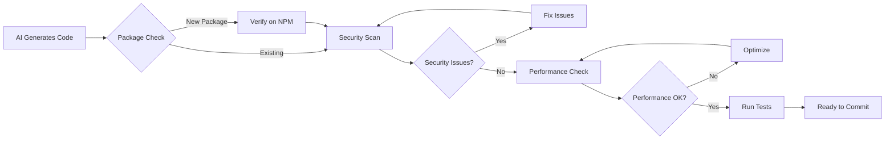

# AI Code Review Guide

## Overview

This guide provides an integrated review process for AI-generated code, addressing the 40% security vulnerability rate and 41% higher bug rate found in AI-generated code. Use this during development, not after.

## Real-Time Review Process

### 1. Package Verification (Before Installation)

```bash
# MUST DO before any npm install
npm view [package-name]  # Verify package exists
npm view [package-name] versions --json | tail -5  # Check latest versions

# Red flags:
- No README or description
- Very recent publish date
- Low download count
- Similar name to popular package
```

**AI Command:** "Verify package exists on npm before suggesting"

### 2. Security Scan (During Coding)

```javascript
// 🚨 STOP: Review these patterns immediately

// SQL Injection Risk
const query = `SELECT * FROM users WHERE id = ${userId}`;  // ❌
const query = 'SELECT * FROM users WHERE id = ?';  // ✅ Parameterized

// XSS Vulnerability  
element.innerHTML = userInput;  // ❌
element.textContent = userInput;  // ✅ Safe

// Command Injection
exec(`git clone ${repoUrl}`);  // ❌
execFile('git', ['clone', repoUrl]);  // ✅ Safe

// Path Traversal
fs.readFile(`./uploads/${filename}`);  // ❌
fs.readFile(path.join('./uploads', path.basename(filename)));  // ✅
```

### 3. Performance Review (While Writing)

```javascript
// 🔍 CATCH: Performance issues as you code

// N+1 Query Problem
for (const user of users) {
  const profile = await getProfile(user.id);  // ❌ Multiple queries
}
// ✅ BETTER:
const profiles = await batchGetProfiles(users.map(u => u.id));

// Memory Leak Risk
elements.forEach(el => {
  el.addEventListener('click', handler);  // ❌ No cleanup
});
// ✅ BETTER:
const cleanup = () => elements.forEach(el => {
  el.removeEventListener('click', handler);
});

// Inefficient Loops
const results = [];
for (let i = 0; i < items.length; i++) {
  results.push(await processItem(items[i]));  // ❌ Sequential
}
// ✅ BETTER:
const results = await Promise.all(items.map(processItem));
```

## Automated Review Tools

### 1. Pre-commit Hooks

```json
// package.json
{
  "husky": {
    "hooks": {
      "pre-commit": "npm run review:ai"
    }
  },
  "scripts": {
    "review:ai": "npm run lint && npm run security-check && npm run test"
  }
}
```

### 2. Security Scanning

```bash
# Install security tools
npm install --save-dev npm-audit snyk eslint-plugin-security

# Run checks
npm audit  # Check dependencies
npx snyk test  # Vulnerability scan
npx eslint --ext .js --plugin security  # Code security
```

### 3. AI-Specific ESLint Rules

```javascript
// .eslintrc.js
module.exports = {
  plugins: ['security', 'no-unsanitized'],
  rules: {
    'security/detect-object-injection': 'error',
    'security/detect-non-literal-regexp': 'error',
    'security/detect-unsafe-regex': 'error',
    'security/detect-buffer-noassert': 'error',
    'security/detect-child-process': 'error',
    'security/detect-disable-mustache-escape': 'error',
    'security/detect-eval-with-expression': 'error',
    'security/detect-no-csrf-before-method-override': 'error',
    'security/detect-non-literal-fs-filename': 'error',
    'security/detect-non-literal-require': 'error',
    'security/detect-possible-timing-attacks': 'error',
    'no-unsanitized/method': 'error',
    'no-unsanitized/property': 'error'
  }
};
```

## Review Checklist Card

```markdown
## 🔍 AI CODE REVIEW CHECKLIST

### ⚡ IMMEDIATE CHECKS (During Generation)
□ Package exists on npm?
□ Using latest version?
□ No SQL concatenation?
□ No innerHTML with user data?
□ No exec() with variables?
□ No hardcoded secrets?

### 🛡️ SECURITY REVIEW (Before Testing)
□ Input validation present?
□ Output encoding used?
□ Authentication checked?
□ Authorization verified?
□ CSRF protection added?
□ Rate limiting implemented?

### 🚀 PERFORMANCE REVIEW (Before Commit)
□ No N+1 queries?
□ Batch operations used?
□ Memory leaks prevented?
□ Async operations optimized?
□ Caching considered?
□ Database indexes needed?

### 🏗️ ARCHITECTURE REVIEW (Before PR)
□ Follows existing patterns?
□ No code duplication?
□ Proper error handling?
□ Logging implemented?
□ Tests written?
□ Documentation updated?
```

## Common AI Vulnerabilities

### 1. Package Hallucinations (19.7% of suggestions)
```javascript
// AI suggests non-existent packages
import { validate } from 'email-validator-pro';  // ❌ Doesn't exist

// ALWAYS verify first:
npm view email-validator-pro  // Check before using
```

### 2. Outdated Patterns
```javascript
// AI uses deprecated methods
componentWillMount() { }  // ❌ React deprecated

// Check documentation dates
React.createClass({ })  // ❌ Removed in v16
```

### 3. Insecure Defaults
```javascript
// AI generates insecure code
app.use(cors({ origin: '*' }));  // ❌ Too permissive

// Review all security settings
app.use(cors({ 
  origin: process.env.ALLOWED_ORIGINS?.split(','),
  credentials: true 
}));  // ✅
```

## Integration Points

### 1. IDE Integration

```json
// VS Code settings.json
{
  "editor.codeActionsOnSave": {
    "source.fixAll.eslint": true
  },
  "eslint.validate": [
    "javascript",
    "typescript"
  ],
  "security.workspace.trust.enabled": true
}
```

### 2. CI/CD Pipeline

```yaml
# .github/workflows/security.yml
name: Security Check
on: [push, pull_request]

jobs:
  security:
    runs-on: ubuntu-latest
    steps:
      - uses: actions/checkout@v3
      - name: Run security audit
        run: |
          npm audit --audit-level=moderate
          npm run lint:security
          npm run test:security
```

### 3. Git Hooks

```bash
# .git/hooks/pre-commit
#!/bin/sh
npm run review:ai || {
  echo "❌ AI code review failed. Fix issues before committing."
  exit 1
}
```

## Review Metrics

Track these metrics for AI-generated code:

```markdown
## AI Code Quality Metrics

1. **Security Issues per 1000 lines**
   - Target: < 0.5
   - Current: ___

2. **Performance Issues Found**
   - N+1 queries: ___
   - Memory leaks: ___
   - Blocking operations: ___

3. **Code Duplication Rate**
   - Target: < 3%
   - Current: ___% 

4. **Test Coverage**
   - Target: > 80%
   - Current: ___%

5. **Dependency Risks**
   - Outdated packages: ___
   - Security vulnerabilities: ___
   - License conflicts: ___
```

## Quick Commands for AI Tools

```markdown
# Add to AI configuration:

Before generating code:
- "Check npm for package existence"
- "Use latest stable versions only"
- "Follow OWASP security practices"
- "Implement proper error handling"
- "Add input validation"

During code generation:
- "Use parameterized queries"
- "Sanitize user inputs"
- "Implement rate limiting"
- "Add authentication checks"
- "Include audit logging"

After code generation:
- "Run security linter"
- "Check for memory leaks"
- "Verify error handling"
- "Add unit tests"
- "Update documentation"
```

## Red Flag Patterns

```javascript
// 🚨 STOP if you see these:

eval()                          // Code execution
innerHTML = variable            // XSS risk
document.write()               // XSS risk
setTimeout(string)             // Code execution
setInterval(string)            // Code execution
Function(string)               // Code execution
.html(userInput)              // jQuery XSS
.append(userInput)            // DOM XSS
onClick="javascript:"         // Inline scripts
<script>${variable}</script>  // Template XSS
require(variable)             // Command injection
import(variable)              // Dynamic imports
fs.*Sync() in async code      // Performance
process.env in client code    // Secret exposure
```

## Review Workflow



## Emergency Response

If AI generates malicious code:

1. **STOP** - Don't execute
2. **ISOLATE** - Don't commit
3. **REVIEW** - Understand the issue
4. **REPORT** - Document the pattern
5. **PREVENT** - Update rules

Remember: AI-generated code needs MORE review, not less. The 41% higher bug rate means assuming correctness is dangerous.