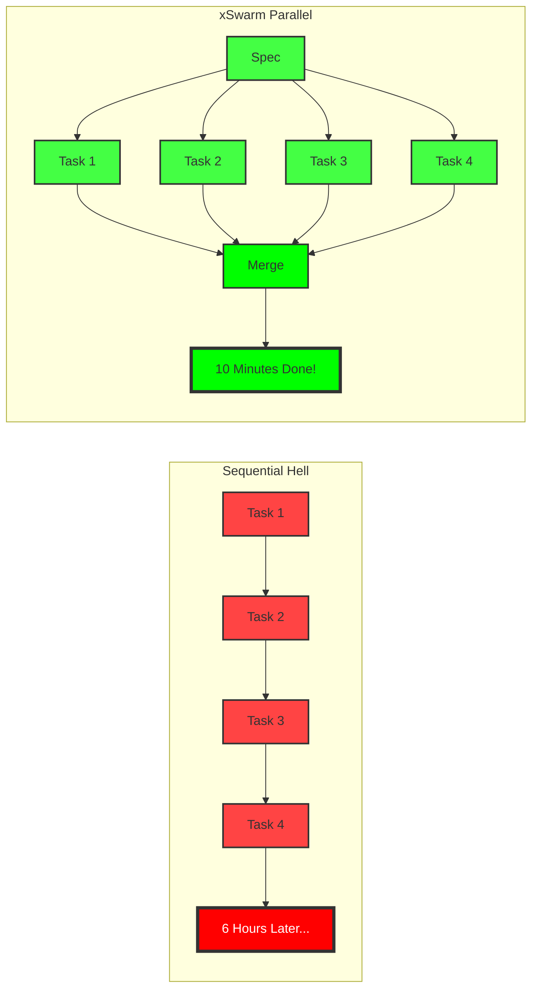
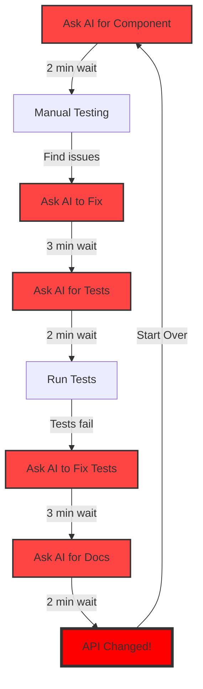
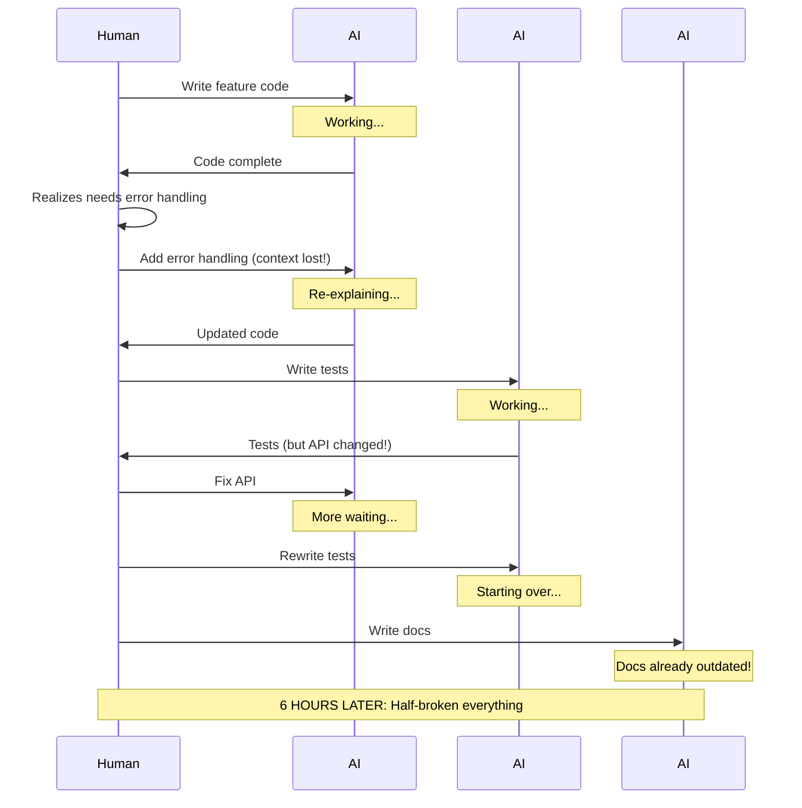

# Why AI Development is Still Stuck in 1995 (Sequential Hell Edition)

> **"We've taken the miraculous power of AI and shackled it to workflows designed for humans in 1995."**

You know that feeling when you're waiting for your AI to finish writing a function so you can ask it to write the tests? That soul-crushing moment when you realize you've been sitting there for 20 minutes, watching a cursor blink, waiting for sequential task number 47 to complete?

Welcome to Sequential Hell. Population: Every developer using "modern" AI tools.

<h4>⚠️ The Brutal Truth</h4>

- **20 minutes** waiting for task 47
- **6 hours** for a feature that should take 30 minutes
- **100%** of developers still using sequential AI workflows

## The Molasses Problem

Here's the thing nobody wants to admit: we've taken the miraculous power of AI and shackled it to workflows designed for humans in 1995. We're moving like a snail stuck in molasses on a glacier, and we're calling it "innovation."

I watched a senior developer yesterday spend his entire morning like this:

By lunch, he'd accomplished what should have taken 30 minutes. The kicker? The AI agents could have done all of this simultaneously.

<h4>⏰ Time Wasted in Sequential Hell</h4>

- **12 minutes** of pure waiting time
- **4 hours** total time for 30 minutes of work
- **8x slower** than parallel execution
- **∞ frustration** accumulated

## Why Sequential Execution is Killing Your Soul

You've got this powerful AI that can write code, tests, and documentation. It doesn't need coffee breaks. It doesn't get distracted by Slack. It doesn't have opinions about tabs vs spaces.

But you're forcing it to work like it's 1995. One. Task. At. A. Time.

> **"Remember waterfall development? That methodology we all agreed was terrible? Congratulations, you've reinvented it with AI."**

Remember waterfall development? That methodology we all agreed was terrible? Congratulations, you've reinvented it with AI. Except now it's worse because you're adding network latency to every single step.

The real tragedy? AI agents have zero ego. They don't get territorial about code. They could be working together in perfect harmony, but instead, we've created the world's most expensive typewriter.

## Horror Stories from the Trenches

Last week, I watched a startup try to ship a critical feature. They had three AI assistants: one for code, one for tests, one for docs. Sequential execution meant:

Six hours later, they had a half-broken feature, failing tests, and documentation that described code that no longer existed. The cascading failures weren't just technical—they were existential.

<h4>💥 The Cascade of Failure</h4>

- **3 AI assistants** sitting idle most of the time
- **6 hours** for a 30-minute feature
- **Context lost** every single handoff
- **100% outdated** documentation on delivery

## The Natural Solution: Parallel Execution

Here's the revolutionary idea that apparently nobody else has figured out: AI agents can work simultaneously. Mind. Blown.

Think about it. When you have a team of humans, do you make them sit in a circle and take turns typing? Of course not. That would be insane. Yet that's exactly what we're doing with AI.

> **"When you have a team of humans, do you make them sit in a circle and take turns typing? Of course not. That would be insane."**

The solution is embarrassingly obvious: let them all work at once. While one agent writes your component, another writes the tests, another handles the documentation. They're all working from the same spec, in isolated environments.

## Enter xSwarm: Actually Getting Something Done Before I Die

This is where xSwarm comes in, and suddenly everything makes sense. Instead of sequential hell, you get:

- Multiple AI agents working in parallel sandboxes
- Each agent has full context from the start
- No waiting for Agent A to finish before Agent B can begin
- Automatic merging of all work when complete

Here's what the same feature looks like with xSwarm:

```mermaid
gantt
    title Parallel Execution with xSwarm
    dateFormat HH:mm
    axisFormat %M min

    section All Agents
    Receive Spec           :done, spec, 00:00, 1m

    section Agent 1
    Write Component Code   :active, code, after spec, 10m

    section Agent 2
    Write Tests           :active, tests, after spec, 10m

    section Agent 3
    Create Documentation  :active, docs, after spec, 10m

    section Agent 4
    Setup CI/CD          :active, cicd, after spec, 10m

    section Result
    Merge & Ship         :crit, merge, 00:10, 1m
```

<h4>✅ The xSwarm Difference</h4>

- **10 minutes** total execution time
- **4 agents** working in parallel
- **0 context switches** required
- **36x faster** than sequential approach

That six-hour nightmare? 10 minutes. And it actually works.

## The Speed Revolution

You know what excites me most? We're finally moving at the speed these tools were meant to enable. No more watching progress bars. No more context switching. No more explaining the same requirements six times because the AI forgot what you were building.

There are two types of developers in this world: those who are afraid to ship fast, and those who are excited to actually get something done before they die. If you're in the second group, parallel AI execution isn't just an optimization—it's liberation.

> **"Imagine your implementation speed matching your thinking speed. Imagine not growing old waiting for sequential task number 382 to complete."**

Imagine actually keeping pace with your ideas. Imagine your implementation speed matching your thinking speed. Imagine not growing old waiting for sequential task number 382 to complete.

<h4>📊 Sequential vs Parallel: The Numbers Don't Lie</h4>

| Metric               | Sequential Hell | xSwarm Parallel |
| -------------------- | --------------- | --------------- |
| Average feature time | 6 hours         | 10 minutes      |
| Context switches     | 15+             | 0               |
| Idle agent time      | 85%             | 0%              |
| Developer sanity     | Gone            | Restored        |
| Will to live         | Questionable    | Strong          |

That's not the future. That's what we're doing right now with xSwarm. While everyone else is stuck in Sequential Hell, we're shipping at the speed of thought.

Welcome to parallel execution. Your sanity will thank you.
