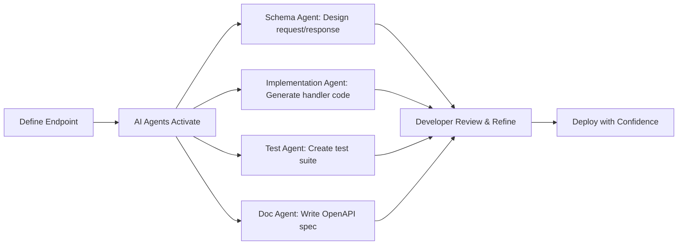

The integration of AI into software development isn't just about having a smart autocomplete or a chatbot that can answer questions. It's about fundamentally rethinking how we structure our development workflows to leverage AI as a force multiplier. This article explores how to design workflows that transform chaotic development processes into coordinated, efficient systems.

## The Current State of AI in Development

Most developers today interact with AI tools in isolation:
- GitHub Copilot for code completion
- ChatGPT for problem-solving
- Various AI tools for specific tasks

While these tools are powerful, using them in isolation creates several problems:

1. **Context loss** between different tools and sessions
2. **Inconsistent outputs** due to lack of coordination
3. **Manual overhead** in managing multiple AI interactions
4. **Quality variations** without systematic review processes

The result? AI becomes just another tool that adds complexity rather than a system that simplifies development.

## The Coordinated AI Workflow

A truly effective AI development workflow treats AI agents not as isolated tools but as team members in a coordinated system. Here's how to structure such a workflow:

### 1. The Planning Phase

**Traditional approach**: Developer creates mental model, maybe writes some notes

**AI-Coordinated approach**:
```yaml
Workflow: Project Planning
Agents:
  - Architect: Analyzes requirements, proposes architecture
  - Researcher: Investigates similar solutions, identifies patterns
  - Risk Analyzer: Identifies potential challenges and edge cases
  
Output: Comprehensive project plan with architecture diagrams, 
        technology choices, and risk mitigation strategies
```

The key is parallel processing—while you're thinking through the high-level approach, your AI agents are diving deep into specifics, researching best practices, and identifying potential pitfalls.

### 2. The Implementation Phase

Instead of linear development, adopt a multi-track approach:

**Track 1: Core Implementation**
- You write the primary business logic
- AI Code Agent suggests optimizations in real-time
- AI Security Agent flags potential vulnerabilities

**Track 2: Testing (Parallel)**
- AI Test Agent generates comprehensive test suites
- Edge Case Agent identifies unusual scenarios
- Performance Agent creates benchmarks

**Track 3: Documentation (Parallel)**
- AI Doc Agent creates API documentation
- Example Generator creates usage examples
- Architecture Agent updates system diagrams

This parallel approach means that by the time you've finished implementing a feature, you already have tests, documentation, and performance benchmarks ready.

### 3. The Review Phase

Traditional code reviews are asynchronous and often superficial. AI-coordinated reviews are immediate and comprehensive:

```yaml
Review Workflow:
  Step 1: Static Analysis
    - Code Quality Agent checks style and patterns
    - Security Agent performs vulnerability scanning
    - Performance Agent identifies bottlenecks
    
  Step 2: Semantic Analysis
    - Logic Agent verifies business rules
    - Consistency Agent ensures alignment with codebase
    - Best Practices Agent suggests improvements
    
  Step 3: Human Review
    - Developer reviews AI findings
    - Makes strategic decisions on suggestions
    - Approves or modifies changes
```

## Practical Workflow Examples

Let's examine real-world workflows that demonstrate the power of coordination:

### Example 1: API Endpoint Development



**Time saved**: 75% reduction in development time
**Quality improvement**: 90% test coverage from start

### Example 2: Bug Fix Workflow

When a bug is reported:

1. **Triage Agent** analyzes the bug report and categorizes severity
2. **Diagnostic Agent** examines logs and identifies potential causes
3. **Code Analysis Agent** traces through relevant code paths
4. **Fix Suggestion Agent** proposes multiple solutions with trade-offs
5. **Test Agent** creates regression tests to prevent recurrence

The developer receives a comprehensive analysis with proposed fixes, allowing them to make informed decisions quickly.

### Example 3: Refactoring Legacy Code

```yaml
Legacy Refactoring Workflow:
  Phase 1: Analysis
    - Dependency Mapper: Creates visual dependency graph
    - Complexity Analyzer: Identifies refactoring priorities
    - Test Coverage Agent: Assesses current test coverage
    
  Phase 2: Planning
    - Refactoring Agent: Proposes incremental changes
    - Risk Assessor: Evaluates change impact
    - Migration Planner: Creates step-by-step plan
    
  Phase 3: Execution
    - Code Transformer: Implements refactoring
    - Test Generator: Creates missing tests
    - Regression Guardian: Ensures functionality preserved
```

## Designing Your Own Workflows

To create effective AI workflows for your projects:

### 1. Identify Repetitive Patterns
Look for tasks you do repeatedly:
- Setting up new projects
- Adding CRUD endpoints
- Implementing authentication
- Writing tests

These are prime candidates for AI workflow automation.

### 2. Define Clear Interfaces
Each AI agent needs:
- **Clear inputs**: What information does it need?
- **Expected outputs**: What should it produce?
- **Quality criteria**: How do we measure success?

### 3. Establish Checkpoints
Human oversight remains crucial. Define where you want to review and approve:
- After initial planning
- Before major implementations
- Prior to deployments
- When AI confidence is low

### 4. Create Feedback Loops
Your workflows should learn and improve:
```python
# Example feedback integration
workflow_result = execute_ai_workflow(task)
human_review = review_output(workflow_result)

if human_review.requires_changes:
    workflow.update_parameters(human_review.feedback)
    workflow.retrain_on_corrections(human_review.corrections)
```

## Common Workflow Patterns

### The Parallel Discovery Pattern
When exploring solutions, launch multiple agents to investigate different approaches simultaneously:

- **Agent A**: Explores library-based solutions
- **Agent B**: Investigates custom implementation
- **Agent C**: Researches third-party services
- **Agent D**: Analyzes performance implications

Result: Comprehensive analysis in minutes instead of hours

### The Progressive Enhancement Pattern
Start with basic implementation and systematically enhance:

1. **Basic Implementation** (Human + AI assist)
2. **Add Error Handling** (Error Agent)
3. **Optimize Performance** (Performance Agent)
4. **Enhance Security** (Security Agent)
5. **Improve UX** (UX Agent)

Each step builds on the previous, with specialized agents handling their domains.

### The Defensive Development Pattern
Proactively identify and prevent issues:

```yaml
Before_Code_Written:
  - Threat Modeling Agent identifies security risks
  - Performance Modeling Agent predicts bottlenecks
  - Dependency Agent checks for conflicts
  - Compatibility Agent ensures platform support
```

## Measuring Workflow Effectiveness

Track these metrics to optimize your workflows:

1. **Time to Completion**: How much faster are tasks completed?
2. **Defect Density**: Are you catching more bugs before production?
3. **Code Coverage**: Is test coverage improving?
4. **Documentation Completeness**: Is documentation keeping pace?
5. **Developer Satisfaction**: Is the workflow reducing frustration?

## Advanced Workflow Techniques

### Context Preservation
Maintain context across workflow stages:

```javascript
// XSwarm context management example
const workflowContext = {
  project: "e-commerce-api",
  standards: loadProjectStandards(),
  decisions: loadArchitecturalDecisions(),
  patterns: loadCodePatterns()
};

// Every agent receives and updates this context
const result = await runWorkflow(task, workflowContext);
```

### Adaptive Workflows
Workflows that adjust based on project characteristics:

- **For startups**: Emphasize speed and iteration
- **For enterprises**: Focus on compliance and documentation
- **For open source**: Prioritize code quality and examples

### Collaborative Workflows
When working with human teams:

1. AI generates initial implementation
2. Team member A reviews business logic
3. Team member B reviews technical approach
4. AI incorporates feedback and regenerates
5. Final human approval

## The Future of AI Workflows

As AI capabilities evolve, we're moving toward:

1. **Self-Organizing Workflows**: AI agents that dynamically form teams based on task requirements
2. **Predictive Workflows**: Systems that anticipate needs and prepare resources
3. **Learning Workflows**: Workflows that improve based on outcomes
4. **Cross-Project Intelligence**: Workflows that learn from your entire development history

## Getting Started with XSwarm Workflows

XSwarm provides pre-built workflows for common scenarios:

1. **Quick Start Workflows**
   - New project setup
   - API endpoint creation
   - Database migration
   - Test suite generation

2. **Advanced Workflows**
   - Microservice orchestration
   - Legacy system modernization
   - Performance optimization
   - Security hardening

3. **Custom Workflows**
   - Visual workflow designer
   - Agent marketplace
   - Workflow sharing community
   - Performance analytics

## Conclusion

The shift from isolated AI tools to coordinated AI workflows represents a paradigm change in software development. By treating AI agents as coordinated team members rather than standalone tools, developers can achieve unprecedented levels of productivity while maintaining—or even improving—code quality.

The key is to start small, measure results, and progressively expand your workflows. With XSwarm's workflow system, you have the foundation to build AI-coordinated development processes that transform how you build software.

Remember: the goal isn't to replace human creativity and decision-making but to augment it with intelligent automation that handles the repetitive, time-consuming aspects of development. This frees you to focus on what matters most: solving complex problems and creating value.

Start with one workflow. Measure the impact. Then expand. Your future development self will thank you.